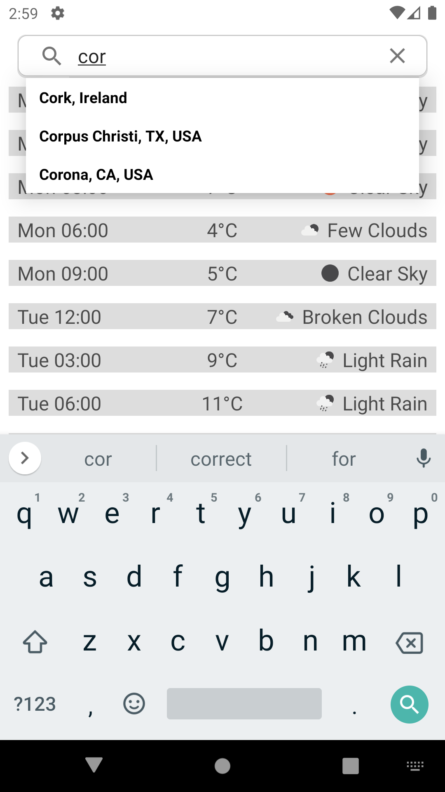

# Weather App v2
Weather app which displays the weather over 5 days for your selected location
Location can be current location, searched location or location from history
Google's places API is used to provide auto-completed location information
Simple database table is used to provide suggestions from previous searches

## Getting Started
The app and tests can be built and run using Android Studio

## The App
There's a single activity - [MainActivty](app/src/main/java/com/marklynch/weather/ui/activity/MainActivity.kt)

Repositories for location, network status, search suggestions and weather data, 
DB for storing searhc history, 
Viewmodel to connect the back and front

## Tests
Unit tests can be found at app/src/test, improving test coverage would be priority 1 going forward
The app has been tested on a Pixel emulator using SDK 29

## Libraries used
**Lifecycle Livedata** for updating ui, **Retrofit** for REST calls, **Moshi** for handling JSON, **Timber** for logging, **Chuck** for monitoring http traffic in debug, **Coroutines** for thrading, **JUnit** for unit tests, **OKHttp Moch Server** for testing REST interface

#### Weather

#### History Suggestions

#### Autocomplete Suggestions

